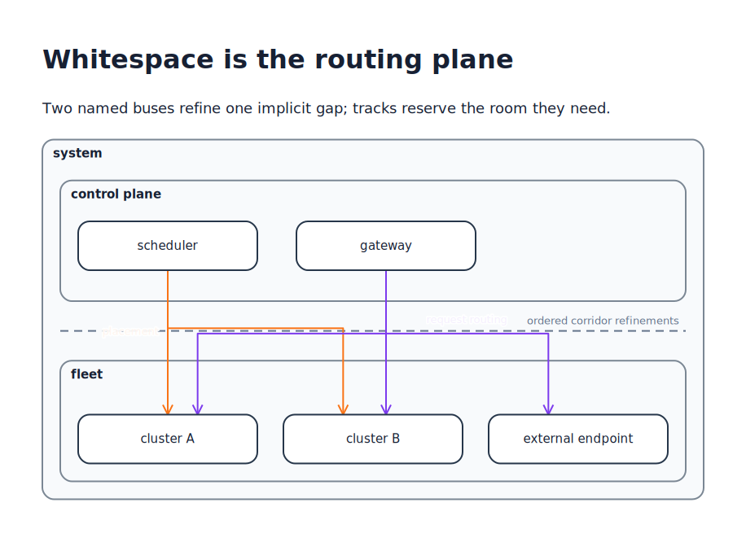
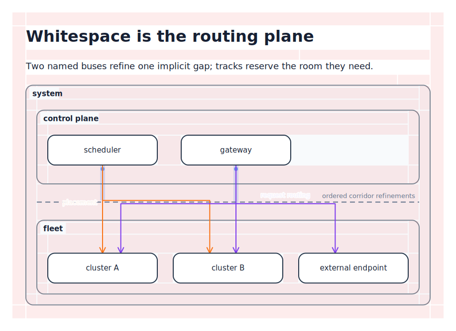
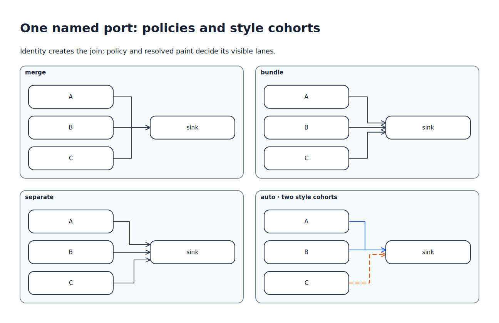
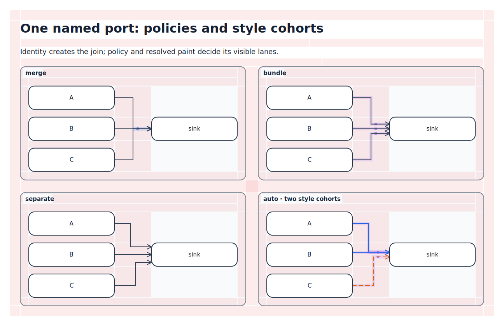
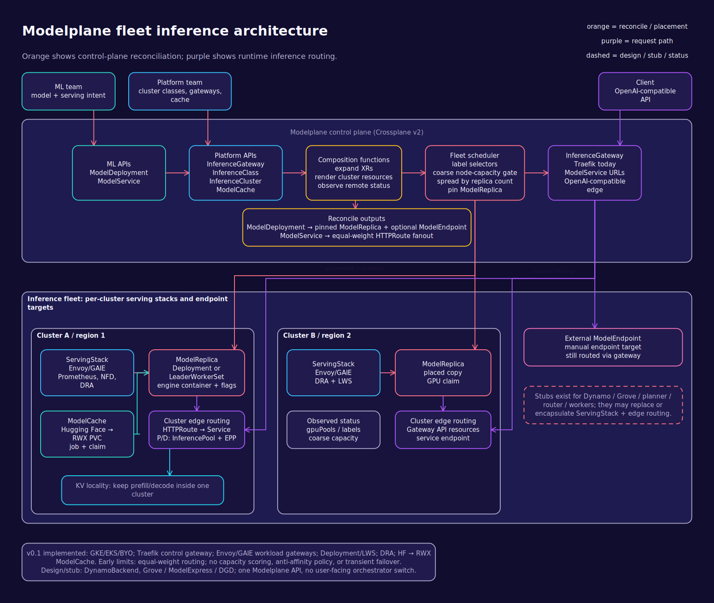

# Kvísl Script Data Model

Status: Working draft

This document defines the conceptual data model and the Logical IR. [REQUIREMENTS.md](REQUIREMENTS.md) states what the system must do; this document defines the shapes those requirements normalize into. Nothing here is final; the reference fixtures under [`examples/`](examples/) are the ground truth the model must be able to express.

<p align="center">
  <a href="docs/diagrams/render-pipeline.tsx">
    
  </a>
</p>

Every diagram in this document is itself authored in Kvísl TSX and regenerated by the local prototype with `npm run build`. The linked source is part of the model's executable design evidence.

## 1. Principles

1. **Normalized graph.** After TSX evaluation and component expansion, a diagram is a flat, renderer-neutral entity graph. No functions, no renderer objects, no pixel coordinates.
2. **Four independent relations.** Containment (a tree), layout (membership plus constraints), routing (regions and lines), and paint order are separate relations over the same entities.
3. **One object primitive.** Containers and shapes are the same kind of entity: an object with optional shape, content, label, ports, children, and orientation. `Node` and `Scope` are authoring shorthands with different defaults, not different primitives.
4. **Orientation is local and semantic.** Every container has a local frame. All directional vocabulary — sides, axes, row/column — is expressed in that frame. Orientation changes layout and routing directions to a declared depth; it never rotates child rectangles, intrinsic dimensions, or upright text.
5. **Whitespace is the routing plane.** Corridors are not free-floating entities. They are the gaps and padding bands that layout produces anyway — implicit, addressable, and space-reserving, like margin and padding in CSS. A `Corridor` declaration refines such a region; it never invents one detached from the structure.
6. **Lines are symmetric and segmented.** A line has two interchangeable ends. It consists of an ordered list of segments; most are implicit and inferred, some are explicitly pinned to a region or waypoint and can carry labels there.
7. **Named ports create joins.** Every port is identified by its owner and local ID. All line ends at that canonical port form one topological join; the port's sharing policy determines whether their adjacent paths merge, bundle, separate, or remain router-selected.
8. **Entity-only endpoints own their docks.** A line end that names no port receives a distinct dock identity derived from that line and end. Coincident automatic docks do not imply a join.
9. **Containers are addressable.** Every author-declared structural container has a local ID and contributes one segment to its canonical containment path. Reusable components therefore create nested namespaces without requiring global IDs.
10. **Presentation is rules.** Structure carries roles and classes; presentation and metric defaults come from typed rules in a layered cascade, CSS-style. Rules never change topology, identity, membership, or routing. Inline styles remain the innermost cascade layer.
11. **Views are ordered alternatives.** View templates are invisible to ordinary paths. A renderer evaluates their conditions against a bounded context — media-query-style — and materializes the first viable view in declaration order, without changing the component's semantic identity or canonical ports.
12. **Drawings depict subjects.** Any entity may carry an opaque reference to a semantic subject defined outside the diagram. The core records and round-trips that reference; interpreting it — identity, consistency across diagrams, metamodel validation — belongs to libraries and tooling.

## 2. Frames and orientation

Every container owns a **local frame**: from the author's point of view inside the container, x runs right and y runs down. All directions written inside are interpreted in this frame:

- sides: `top`, `right`, `bottom`, `left`;
- axes: `horizontal`, `vertical`;
- layout strategies: `row` flows along local x, `column` along local y;
- anchor placements, corridor axes, and endpoint side hints.

A container declares its orientation relative to its parent frame and how many nested frame boundaries receive it:

```ts
type Orientation = 0 | 90 | 180 | 270; // clockwise, default 0
type OrientationSpec =
  | Orientation                              // sugar for depth: 1
  | { degrees: Orientation; depth?: number | "all" };
```

`orientation={90}` changes the declaring container's layout from a physical row to a physical column and maps the relevant child sides, ports, corridors, and routes accordingly. The children keep their own width, height, shape, and upright contents. It is therefore an axis remapping, not a geometric rotation of the rendered subtree.

The numeric form has `depth: 1`: it affects that container's layout and the directional attachment semantics of its direct children, then stops at the next nested layout frame. A finite larger depth cascades through that many layout/frame boundaries; `depth: "all"` cascades through the complete subtree. Cascading orientations compose in 90° steps. Depth counts normalized structural frame boundaries, never JSX fragments or component-function calls.

<p align="center">
  <a href="docs/diagrams/orientation.tsx">
    
  </a>
</p>

Rules:

- Orientation is author-set. The solver does not rotate containers on its own. An `auto` orientation may be added later as an explicit opt-in.
- Object geometry and intrinsic dimensions never rotate merely because layout orientation changes. Text stays physically upright by default; explicit painterly text rotation is an independent presentation property.
- Mirroring (flips) is not part of the first model version and is listed as an open decision.

## 3. Containment, containers, and identity

Every ordinary structural container — including the diagram root, every `Scope`, explicit layout containers, `PortGroup`, and objects that own diagram entities — has a required local ID. IDs are unique among direct siblings, never globally. Every ordinary container contributes a segment to the canonical containment path; layout containers are therefore addressable even though their purpose remains layout rather than semantic grouping.

`View`, `When`, and `Switch` also require IDs, but they belong to a separate meta tree. Neither a meta container nor any unmaterialized template descendant appears in ordinary path lookup.

References are resolved relative to their containing ordinary container. `/` descends into a named child container, `..` ascends one container, `.` selects a named port on an entity, and `.#` selects a named port group (`voice-agent.#loop`). For example:

```text
platform/production/control-plane/api.request
```

The address remains stable across component-view selection. `production/internals/layout` cannot accidentally reach a view named `internals`; normal lookup never enters that meta branch. A reusable component may contain the same relative path in every instance because its root container ID creates the instance namespace.

A component may refer to its own root region with the `self` alias — `padding(self, "left")` — instead of climbing out and naming itself from the parent side, which would couple the component to its externally assigned position.

Every entity has exactly one containment parent. Layout, routing, and paint relations may reference any entities regardless of containment.

Port-group JSX children are membership shorthand rather than containment. Ports remain directly owned by their object, so placing `tasks` inside `<PortGroup id="loop">` does not change the endpoint from `voice-agent.tasks` to `voice-agent/loop/tasks`. The group itself remains an addressable relation entity.

Objects with children are full endpoints: they can carry ports, be targets of lines, and anchor annotations.

<p align="center">
  <a href="examples/agent-substrate/diagram.tsx">
    
  </a>
</p>

The generated Agent Substrate fixture exercises the consequence of this identity model: layout containers, nested runtime boundaries, and deeply contained objects remain addressable while lines cross their hierarchy without flattening it.

### 3.1 Semantic subjects

An entity may declare a **subject**: a namespaced, opaque reference to a semantic entity defined outside the diagram (`{ namespace: "uml", id: "sales/Order" }`). Several depictions — a class in a class diagram, a lifeline classifier in an interaction, an artifact in a deployment — can reference the same subject from different documents. The normalizer stores and serializes the reference without interpreting it. Cross-diagram identity management, subject catalogs, and metamodel validation are library and tooling concerns; TSX makes the authoring side nearly free because a subject is just a module-level TypeScript value that several diagram files import.

## 4. Objects, content, and sizing

There is one **object** primitive. An object may have, in any combination:

- a shape primitive (rectangle, ellipse, diamond, text, image, or a namespaced extension shape);
- structured content: text runs, icons, images, and role-tagged content groups;
- a label: boundary caption text, normalized as a content entry with role `label`;
- ports;
- contained children and a layout for them;
- a local orientation;
- an anchor relation instead of layout membership (section 10);
- a size policy.

Metric props — `margin`, `padding`, `gap` — are sugar for inline-layer declarations of the same style properties: they have exactly one home, the cascade, so a rule default and a prop resolve through the same mechanism.

`Node` and `Scope` are authoring shorthands over this primitive: `Node` defaults to a visible shape with content and no children; `Scope` defaults to a container with children, an optional boundary, and a label. Neither introduces a second entity kind. A `Scope` with a shape (`uml:package`, `rounded-rectangle`) and a `Node` that owns nested entities are both ordinary objects.

Sizing is intrinsic by default — derived from content, children, padding, and minimum/maximum bounds. Fixed sizes are geometric constraints, not positions.

**Content groups.** An ordered content run may contain nested groups with a role (`attributes`, `operations`, ...). Groups are the model for compartments — a theme derives dividers and spacing between adjacent groups from their roles, so notation like UML class compartments needs no empty divider pseudo-content. The authoring surface exposes groups as `<Compartment role="...">` children.

**Text is context-dependent sugar.** `<Text>` inside an object normalizes to a content entry of that object. `<Text>` written where a placeable object is expected — as a layout child — normalizes to an object with a text shape. A `label` prop on an object normalizes to a content entry with role `label`. All three are the same underlying content model.

<p align="center">
  <a href="examples/uml/class-diagram.tsx">
    
  </a>
</p>

The UML class library is a useful stress case for the single object primitive: names, attributes, and operations are structured content groups; associations and generalizations remain ordinary port-attached lines.

## 5. Layout

Layout is a facet of every container object: it arranges the container's placeable children. Strategies compose recursively: `row`, `column`, `stack`, `overlay`, `grid`, `tree`, `radial`, `layered`, `constraint`. A container that should enclose objects it does not contain is a frame (section 10), not a layout.

**Membership.** The member set is derived, never listed: JSX children minus a fixed carve-out. Only placeable objects become members — lines, segments, ports, port groups, corridors, constraints, rules, and anchored objects are declared among the same children but never join the member set. An object with an `anchor` leaves the member set; removing the anchor puts it back.

**Ordering.** The default ordering policy is `prefer-source`: source order is a soft preference the solver may override only when it clearly reduces crossings, route length, or space. `free` releases the order entirely; `fixed` makes source order a hard constraint.

**Alignment and distribution.** A layout may align members on its cross axis (`start`, `center`, `end`, `stretch`) and distribute them on its main axis (`start`, `center`, `end`, `space-between`, `space-around`). These are layout parameters in the IR, not styles; their default values may come from rules like other metrics.

### 5.1 Component views

A component view is a named meta branch owned by a component container. Its descendants are template declarations, not active diagram entities. The branch and its template-local IDs are available to normalization, validation, and explicit meta-reference validation, but ordinary path resolution cannot see them.

**Selection is media-query-like, first fit wins.** The views of one owner form an ordered list — declaration order is preference order, consistent with the language's source-order principle. The renderer creates an immutable context for each component instance (target medium, page or viewport class, outside-in allocation, purpose, semantic state, capabilities). It then walks the owner's views in order and materializes the **first** view whose `requires` condition holds, whose footprint fits the allocation, and which the render policy permits (a forced view or a detail bound filters the list first). There is no score arithmetic and no tie-breaking: order decides.

If layout or routing later shows that a tentatively selected view cannot be solved, the renderer discards it and continues with the next view in order. Selection is deterministic for identical model, target, policy, and solver version. A forced view that is not viable is a diagnostic, never a silent substitution.

Conditions inside the winning branch (`when` on template entities, `When`/`Switch` meta containers) adapt the instantiated structure using the same context. The condition model is shared with styling rules (section 12): one `ConditionIR`, three consumers — view selection, template conditionals, and conditional rules.

Footprint, readability, routing space, and hard constraints can invalidate a tentative winner and cause deterministic fallback to the next view. Logical IR retains all templates and conditions. Projection IR records concrete render instances and the selection explanation; Solved IR retains their provenance.

The owner and its ports exist independently of every view. `PortPlacement` maps a stable port onto a template anchor without cloning its semantic identity. External connections normally target those stable ports.

<table>
  <tr><th>Detailed view selected for a wide allocation</th><th>Summary view selected for a narrow allocation</th></tr>
  <tr>
    <td><a href="docs/diagrams/adaptive-service.tsx"></a></td>
    <td><a href="docs/diagrams/adaptive-service.tsx"></a></td>
  </tr>
</table>

An ordinary deep endpoint is resolved against Projection IR. If the selected rendering did not instantiate its complete suffix, the endpoint truncates to the deepest instantiated object and attaches there automatically.

An exceptional endpoint-alternative reference contains a common ordinary prefix and cases keyed by the selected view of an object on that path. The normative authoring form is a typed helper — a string mini-grammar would violate the "no custom syntax embedded in TSX text" rule:

```tsx
to={alt({
  prefix: "api",
  cases: [{ base: "foo", view: "view", suffix: "abc" }],
  default: "foo/bar",
})}
```

If the renderer instantiated `foo` with the view named `view`, the selected case continues through branch-local `abc`; otherwise the default case continues through ordinary `foo/bar`. Exact view cases precede the default, and truncation remains the final fallback. A compact string spelling such as `api.{foo#view:abc, foo:bar}` may exist as documented sugar, but it must normalize to exactly the same structured value and never exposes the meta tree to general path lookup.

## 6. Whitespace: margins, padding, gaps, and corridors

This is the CSS box model analogy at the core of routing:

- Every object has a **margin** (whitespace demanded outside its border) and every container a **padding** (whitespace between its border and its content).
- The whitespace between two layout siblings — merged margins plus the layout gap — is a **gap region**.
- The whitespace between a container's border and its content on one side is a **padding band**.

Gap regions and padding bands are the diagram's **corridors**. They exist implicitly for every layout; they are addressable; and lines route through them by default. Like margins in CSS, they interact with layout: a corridor that carries tracks widens until its content fits, and the surrounding layout moves accordingly. Routing is therefore never an overlay pass on finished geometry.

<table>
  <tr><th>Solved drawing</th><th>The same drawing with routing-debug geometry</th></tr>
  <tr>
    <td><a href="docs/diagrams/routing-corridors.tsx"></a></td>
    <td><a href="docs/diagrams/routing-corridors.tsx"></a></td>
  </tr>
</table>

The translucent red cells in the debug rendering are not explanatory overlays drawn by hand. They are the canonical channel regions consumed by the router. Horizontal and vertical tracks run on their centerlines; bundles are centered as a group; corner cells provide the graph transitions between adjacent bands. Thus the debug painter and router inspect one geometry rather than independently reconstructing whitespace.

Regions are addressed structurally:

```ts
gap(a, b)                // whitespace between two layout siblings
padding(container, side) // whitespace band inside a container edge (local side)
padding(self, side)      // the same, for the declaring component's own root
```

A `Corridor` declaration refines an implicit region:

- names it, so segments and constraints can reference it;
- sets minimum and preferred track spacing, capacity, and packing pressure;
- orders tracks and other corridors within the same region (several corridors may subdivide one gap, ranked by declaration order by default);
- optionally carries a **divider**: a drawn separation line with a label. A horizontal boundary line between two bands is a decorated gap, not an element.

**Pressure** is an optimization weight penalizing occupied cross-sectional width: high pressure packs tracks toward minimum spacing and makes permitted bundles and merges more attractive. It never overrides hard minimum spacing or sharing prohibitions.

Objects may sit inside a corridor (a decision diamond in the middle of a vertical run). Track order within a corridor is constrainable, including relative to such resident objects.

## 7. Ports and port groups

A **port** is a named attachment point on an object. Ports are symmetric: they have no input/output direction — direction belongs to lines. A port declares:

- a preferred or required side and position in the local frame;
- cardinality (`one`, `optional`, `many`; geometric ports default to `many`);
- capacity and minimum spacing for attached lines;
- optionally a content type tag for compatibility checking;
- an optional visible marker;
- a sharing policy for the lines joined there.

The canonical identity of a named port is `(owner entity, local port ID)`. An endpoint such as `api.request` creates that port implicitly when no declaration exists. A nested `<Port id="request" .../>`, a post-hoc `<Port ref="api.request" .../>`, and a TSX handle bound there all refine or alias that same identity. The normalizer collects these forms before merging properties, so source order is irrelevant. Conflicting explicit property values are diagnostics.

Implicit creation absorbs typos: `api.reqest` silently becomes a second port and a separate join. The normalizer therefore warns when an implicitly created port has exactly one attachment and an ID close to another port on the same owner, and a container can opt into `strictPorts`, where endpoints may only name explicitly declared ports.

Every line end has a dock identity. An endpoint naming only `api` receives a line-owned dock whose identity is derived from `(line key, end index)` and whose position is chosen by the router. It does not synthesize the stable named port `request` or any other author-visible ID. Two lines targeting `api` without a port own distinct docks and do not join even if solving places those docks at the same coordinate.

Semantic identity and solved terminal geometry are separate. One canonical named port remains one dock identity and one join end when collision-free bundle or separate geometry gives its attached lines several physical terminal slots. A `PortGroup` preserves the distinct identities of all member ports. An explicit share group may coordinate distinct named-port or line-owned docks without unifying them; entity-only endpoints acquire no sharing relation merely because their target object, side, or solved coordinate is equal.

A dock carries a base presentation style. Its line contributes an overlay to the rendered dock: non-conflicting properties from both are retained, and the line wins property conflicts. Named-port docks and line-owned docks use the same cascade. Dock-only properties such as marker shape or fill therefore compose with line properties such as stroke or width. Dock styles participate in the general rule cascade of section 12 like every other presentation property.

**Component boundaries.** Components are ordinary TSX functions. To let callers attach lines without knowing internals, the runtime provides opaque port handles:

```ts
declare function port<T>(options?: { cardinality?: "one" | "optional" | "many" }): PortHandle<T>;
```

A handle is created by the caller, passed as a prop, and bound exactly once inside the component to a concrete port (`<Port bind={handle} .../>`) or forwarded to a child component. Handles are TSX-level composition constructs; they are fully resolved before Logical IR is emitted.

**Port groups** collect several distinct ports of one owner. They are unnecessary for multiple lines at one named port. A group keeps its members adjacent and ordered, and sets the default sharing behavior for lines attached to them:

- `merge` — attached lines form a share group drawing one common path;
- `bundle` — attached lines run closely parallel but remain separate strokes;
- `free` — no implied relation (default);
- `separate` — anti-affinity: attached lines must not share and are kept visibly apart.

For a bundled group, member order is also terminal lane and dock-slot order. The solver may position the block but does not exchange port identities or cross its lanes at the terminal.

Equivalent same-direction approaches may share an alignment coordinate when their occupied intervals are disjoint and the coordinate is legal for every member. This applies even to `free` affinity as a visual heuristic, but it does not create shared geometry or bundle topology.

<table>
  <tr><th>Solved named-port policies</th><th>Canonical share groups, lanes, slots, and branch pins</th></tr>
  <tr>
    <td><a href="docs/diagrams/port-sharing.tsx"></a></td>
    <td><a href="docs/diagrams/port-sharing.tsx"></a></td>
  </tr>
</table>

The four panels share identical object and endpoint topology. Three vary only the named port's explicit sharing policy; the fourth shows `auto` partitioning compatible and incompatible paint into two style cohorts. The resulting adjacent geometry is direct visual evidence of those model fields.

## 8. Lines and segments

A **line** is the semantic connection unit.

- **Two symmetric ends.** `from` and `to` are positional labels for `ends[0]` and `ends[1]`, nothing more. Arrowheads are properties: `heads = "forward" | "backward" | "both" | "none"` (default `forward`, meaning a head at `to`), with per-end head shapes available through structured ends.
- **Endpoints** reference a port or an object. A named port supplies the dock identity. Without a port, the endpoint owns a distinct automatic dock and the router selects its position; an optional local `side` hint constrains it.
- **A line is an ordered list of segments** from end to end. Segments are:
  - `implicit` — inferred by the normalizer: hierarchy climbs and descents toward the least common ancestor, and connective runs through implicit corridors. Authors never enumerate crossed boundaries.
  - `explicit` — authored pins. An explicit segment either passes `through` a region (a named corridor, `gap(...)`, or `padding(...)`) or `via` a waypoint entity. Explicit segments are where labels live: "this line goes out into the whitespace between the boxes, and the label sits there."

Labels belong to segments and to ends. A segment label has a placement along its segment (`start`, `center`, `end`, `auto`) and an orientation (`auto`, `upright`, or `along` the segment); an end label renders near its dock. Automatic orientation prefers upright text above or below a horizontal run, then text rotated along a vertical run, then upright text beside a vertical run. Upright multiline text beside a vertical run aligns its route-facing edge: left-aligned on the right and right-aligned on the left. A line-level `label` is sugar for an automatically placed label on the line's most prominent run.

A segment label occupies the same semantic container space as its solved run. A label authored in a gap, padding band, or corridor stays inside that region's cross-section. When it does not fit, its measured box enlarges that one whitespace reservation; border clearing may not move it into a neighboring container.

**Structured ends.** Instead of `from`/`to` props, a line may declare its two ends as children — the line then reads literally from end to end, with segments in between:

```tsx
<Line id="customer-orders" role="uml-association">
  <End ref="customer.orders" head={hollowDiamond}
       labels={[{ text: "customer", role: "role" }, { text: "1", role: "multiplicity" }]} />
  <Segment through={gap("customers", "orders")} label="orders" />
  <End ref="order.customer" head="open-arrow"
       labels={[{ text: "0..*", role: "multiplicity" }]} />
</Line>
```

An `End` carries the endpoint reference plus everything that adorns that end: per-end head, dock style, side hint, and ordered end labels. Exactly two `End` children are required when the form is used; mixing `End` children with `from`/`to` props, or with a conflicting line-level `heads` value, is a diagnostic. `from`/`to` remain the sugar for the common two-liner and normalize into the same two endpoint records.

Lines reserve routing space by default (`space: "reserve"`); `overlay` opts a line out of layout and route-occupancy interaction. Overlay intersections therefore do not displace either the overlay or reserving lines. A line may list regions to `avoid`.

A visible semantic container is a topological boundary, not another patch of routing whitespace. A line may enter it only when an endpoint resolves to that container or one of its descendants. A source-side route leaves such a boundary once; a target-side route enters it once and stays inside until docking. Otherwise the inferred segments remain in surrounding gaps and padding bands and route around the container. `overlay` changes reservation and collision behavior but not this topology. Layout-only containers without a visible boundary do not create this barrier, and visual frames do not create it because they do not change containment.

## 9. Sharing: port joins, groups, trunks, and branches

All line ends attached to one canonical named port belong to its topological join group. The port's sharing policy controls adjacent positive-length geometry: `merge` draws one trunk, `bundle` draws close parallel strokes, `separate` permits only the common semantic endpoint and splits immediately, and `auto` lets the router choose. `auto` is the default.

Port-group affinity coordinates lines on several distinct ports. An explicit line share group coordinates lines with no common named port. Neither creates a second identity for a join already induced by a canonical port.

Within a share group:

- the shared path is **maximal by default**: branches happen as late as possible relative to the common end. Preferences `early` and `balanced`, and a constraining branch region (`within: gap(...)` or a corridor), remain available;
- `merge` draws one genuine shared trunk; `bundle` keeps parallel strokes; `auto` lets the router pick;
- share-style compatibility is evaluated on each proposed positive-length common piece after cascade resolution and segment-local overrides. Only properties affecting that visible stroke participate. Branches remain independent, so a dashed branch may enter a solid merged trunk when the common piece itself resolves to one style;
- differently styled visible strokes never lie on the same centerline for positive length. A fallback-capable relation becomes parallel bundle lanes (or separate tracks when no bundle relation exists); a required `merge` with incompatible shared-piece styles is a diagnostic. The renderer never chooses one member's style or paints coincident incompatible strokes;
- an automatic multi-style group is partitioned into stable style cohorts. Different cohorts become adjacent bundle lanes, while compatible members may merge inside one cohort lane. An explicitly requested `bundle` remains one lane per semantic line;
- branch approaches that enter the same join or bundle front use one aligned orthogonal bend coordinate when their occupied intervals are disjoint and the channel mesh permits it. Alignment does not fuse their track identities: merge branches share only from the solved join onward, while bundle approaches remain distinct through their terminal lanes;
- fan-out and fan-in are symmetric: a group whose common end is a target behaves identically with roles reversed.

Every group has one **common end**. For a named-port join it is the canonical port. For a `PortGroup` it is the ordered terminal block of its distinct member ports. An explicit share group identifies the corresponding end of every member line; it may coordinate distinct line-owned docks on one target boundary, but it does not create a named port. A group from which no unique common end can be derived is invalid.

Bundle membership is monotonic toward the common end: once a line enters, it stays in the bundle until that end, and lane order does not swap along a continuous bundled run. A line cannot leave and re-enter closer to the end. Any required reordering is an explicit branch outside the bundle, not a hidden crossing within it.

The terminal of a bundle remains a bundle. Each visible lane owns a positive-length terminal run, arrowhead when present, and physical dock slot. An explicit bundle has one lane per semantic line; an automatic multi-style bundle may use one merged lane per compatible style cohort. Different terminal head geometry at the same canonical named port also creates distinct automatic terminal lanes even when the shared-piece strokes match. Slot spacing includes stroke width, port minimum spacing, marker extent, and arrowhead extent; the final run is long enough for the head before its last bend. Slots beneath the same named port form a compact local block and remain closer than independent docks where constraints permit. They are Solved-IR geometry, not additional `PortIR` or dock identities. `PortGroup` slots correspond to its ordered member ports; explicit groups of entity-only endpoints retain one line-owned dock per line.

`separate` attachments on one named port also receive collision-free physical approach slots when coincident terminal strokes or heads would otherwise overlap. They use visibly wider independent spacing than a bundle, preserve crossing-minimizing terminal order, and authorize no positive-length sharing; the slots still resolve to the one canonical port identity.

Explicit segments of grouped lines that pin the same region participate in one coordinated run there. They become one trunk only when the effective mode is `merge` and their shared-piece styles are compatible; otherwise the region contains the group's ordered bundle lanes.

## 10. Anchoring and frames

**Anchoring** is a capability of every object, not a separate entity kind. An object with an `anchor` names an entity or region and a structured placement relative to it, in the anchor's local frame:

```ts
interface PlacementSpec {
  area: "inside" | "outside";
  side?: Side | "auto";                 // outside: which side; inside: which edge
  align?: "start" | "center" | "end";   // along that side
}
```

An anchored object leaves layout membership; an object without an anchor participates in layout like any other. Annotations, titles, legends, and footers are library components (`Note`, `Title`, `Legend`, ...) built on this capability plus roles for the theme.

**Frames.** A container may visually enclose objects it does not contain: a boundary object plus an `inside` constraint listing the members. The container's size then derives from the constrained members plus padding, and the container paints behind them by default. This is the model for UML combined fragments and similar overlays — the members' containment, layout, and addresses stay where they are; only the drawn boundary spans them.

## 11. Constraints and paint order

Constraints are typed, serializable, and carry a strength (`required` or a weighted preference). Partial orders are preferred; unmentioned entities stay unconstrained; hard cycles are diagnostics.

The core families:

- **order** — one relation with three bases: position within a layout, spatial order along a local axis, or track order within a corridor region. The authoring conveniences `below`, `above`, `between`, and port or corridor ordering all normalize to it.
- **adjacent**, **align**, **same-size**, **near**, **avoid-overlap** — as in common constraint layout systems.
- **inside** — members lie within a container's bounds (with padding); also the basis of frames (section 10).
- **extent** — stretches one object along an axis between two anchor entities: activation bars, fork/join bars, brackets. The exact edge-versus-center anchor semantics remain to be refined.

**Frame of reference.** Axes and sides in spatial constraints — `order` with a spatial basis, `align`, `extent`, `below`/`between` sugar — are interpreted in the local frame of the constraint's declaring container, exactly like every other directional word. Constraints spanning objects in differently oriented subtrees therefore stay unambiguous: the declaring container's frame decides.

Paint order is an independent relation of `before`/`after` pairs.

## 12. Styling: rules, cascade, and conditions

Structure carries `roles` and `classes`; presentation comes from **rules**. A rule is typed data: a selector, an optional condition, and a set of declarations. Rules live in a fixed layered cascade:

```text
renderer default  <  theme  <  library  <  document  <  inline style prop
```

Within one layer, later rules win; across layers, the higher layer wins. There is no CSS specificity arithmetic — layers replace it. The dock cascade of section 7 (line overlays dock) is the same mechanism at the innermost level.

**Tokens.** A cascade layer may define named tokens — the custom-property analog: `tokens({ "pale-blue": "#dbeafe", large: 24 })`. Length- and color-valued properties reference tokens by name (`gap="large"`, `stroke: "pale-blue"`); resolution follows the same layer precedence as rules, so a document can override a theme's palette or spacing scale without touching any rule. A color name that resolves to no token passes through as a literal for the painter; a length name that resolves to no token is a diagnostic, because a length has no literal string form. The spacing words and palette names throughout the fixtures are theme-supplied tokens.

**Selectors** match on entity kind, shape, roles, classes, and IDs, combined with descendant and child combinators. Two deliberate exclusions:

- no structural pseudo-classes (`nth-child`, sibling combinators): the solver may reorder layout members, so selectors depending on source or solved order would be unstable;
- multi-step structural selectors do not cross **style boundaries**. A component's root container is a style boundary by default (the runtime marks it during expansion; a component may opt out). Roles and classes are the public styling API that themes match across boundaries — the `::part` lesson from the web, adopted as the default instead of the exception.

**Conditions** on rules are the same `ConditionIR` used by view selection and `When`/`Switch`: comparisons over the bounded renderer context (medium, page class, allocated inline/block size, purpose, state, capabilities). A conditional rule is a media query or container query; conditions read the outside-in allocation, never solved geometry, so no styling/layout cycle exists.

**What rules may set.** Presentation properties (fill, fill style, stroke, stroke width, dash, opacity, roughness, fonts, text orientation, dock markers) and metric defaults (margin, padding, gap, minimum sizes, spacing). Metric properties resolve before layout and routing, like every size-affecting input.

**What rules may never do.** Author or replace topology, identity, membership, ports, sharing policy, route pins, layout strategy, or entity existence. There is no `display: none` analog — structural alternatives belong to views and `When`. Corridor pressure and port sharing policies are semantics, not styles. Resolved paint nevertheless constrains geometric feasibility: stroke and head extents consume space, and incompatible shared-piece styles prohibit a coincident merge under section 9. An allowed bundle fallback is a solved representation of the existing policy, not a style-authored topology change; a required merge remains required and therefore diagnoses incompatibility.

**Inheritance.** Inheritable properties (fonts, stroke color, roughness, text orientation) flow down containment unless overridden; box and metric properties do not inherit.

The authoring surface uses typed helpers (`rule(...)`, `role(...)`, `cls(...)`, `within(...)`) or the equivalent restricted CSS syntax; both normalize to the same `SelectorIR`, rules, and tokens. A standalone `.kvisl.css` file is an ordinary importable module whose default export is an immutable stylesheet value:

```tsx
import corporateStyle from "https://raw.githubusercontent.com/company/styles/3f2a91c/architecture.kvisl.css";

export default <Diagram id="platform" styles={corporateStyle}>{/* ... */}</Diagram>;
```

Attaching the imported value at the diagram root applies it document-wide, including public role and class selectors across component style boundaries. Importing it alone has no global side effect. Stylesheet `@import` declarations and referenced assets are transitive build dependencies and use the same URL resolution, lock, cache, integrity, and offline rules as TSX modules. The stylesheet surface is only a serialization of the typed style model: unsupported browser CSS and untyped properties are diagnostics, never painter pass-through.

<p align="center">
  <a href="examples/modelplane-fleet-inference/neon-infrastructure.tsx">
    
  </a>
</p>

This alternate rendering uses the same objects, ports, layouts, constraints, corridors, segments, and line topology as the ordinary Modelplane fixture. Only its typed tokens and rules differ.

**Deliberate CSS exclusions.** Specificity arithmetic, `!important`, structural pseudo-classes and sibling combinators, `display: none`, pseudo-elements, state selectors, animations, and untyped properties are excluded on purpose — the rationale for each is recorded in [REQUIREMENTS.md](REQUIREMENTS.md) section 12.6. Layers replace specificity; views and `When` own structure; rules never create entities or react to interaction or time.

## 13. Logical IR

### 13.1 Invariants

- Every entity has a compiler-internal `EntityKey`: deterministic for identical input, unique per document, not authored, not stable across arbitrary edits.
- The **canonical containment address** is the identity that survives edits and builds. Exports, provenance, and painter output IDs derive from it, not from `EntityKey`, so regenerating a diagram can update an existing output document instead of replacing it.
- Author IDs remain containment-local bindings; every structural container has one, and the normalizer resolves hierarchical paths to keys.
- A port's canonical identity is its resolved owner plus local port ID, regardless of whether it was implicit, explicitly declared, configured post-hoc, or reached through a handle.
- Every entity-only endpoint has a line-owned dock identity derived deterministically from its line key and end index. Such a dock is not an entity in the ordinary address space and never creates an implicit join.
- Port handles are resolved before emission; provenance may record the component property and port involved.
- View templates remain present in the meta domain of Logical IR and are invisible to ordinary references. Renderer materialization creates separate instance keys in Projection IR.
- Rules are entities of their declaring layer and never alter the entity graph they style.
- No functions, symbols, cycles, renderer objects, or absolute positions.

### 13.2 Document and entities

```ts
type EntityKey = number;
type LocalId = string;

type EntityKind =
  | "object"
  | "view"
  | "conditional"
  | "port-placement"
  | "port"
  | "port-group"
  | "corridor"
  | "line"
  | "segment"
  | "rule"
  | "token-set"
  | "constraint";

interface LogicalIR {
  schema: "kvisl.logical";
  version: string;
  root: EntityKey; // the diagram root object
  entities: readonly EntityIR[];
  paint: readonly PaintRelationIR[];
  extensions?: Readonly<Record<string, unknown>>;
}

interface SubjectRef {
  namespace: string;
  id: string;
}

interface EntityBase<Kind extends EntityKind> {
  key: EntityKey;
  kind: Kind;
  id: LocalId | null;
  domain: "ordinary" | "meta";
  parent: EntityKey | null;
  subject?: SubjectRef;
  when?: ConditionIR; // meta domain only; on an ordinary entity it is a diagnostic
  roles: readonly string[];
  classes: readonly string[];
}

type EntityIR =
  | ObjectIR
  | ViewIR
  | ConditionalIR
  | PortPlacementIR
  | CorridorIR
  | PortIR
  | PortGroupIR
  | LineIR
  | SegmentIR
  | RuleIR
  | ConstraintIR;
```

For `domain: "ordinary"`, `parent` is both containment and the parent used to construct author addresses; the nearest local frame is simply the nearest ancestor object, so no separate frame pointer exists. Ordinary lookup ignores every `domain: "meta"` entity. Meta parents instead form a hidden template tree rooted at a `ViewIR` or conditional meta container. `id` may be `null` only for compiler-generated or explicitly non-addressable leaf entities; it is required for every author-declared ordinary or meta container.

`roles` and `classes` are meaningful on styleable entities — objects, ports, lines, segments, corridors; relation entities such as rules, token sets, and constraints carry them only as empty arrays. `when` belongs to the Adaptive profile and may appear only on meta-domain entities: a Core consumer never evaluates conditions.

### 13.3 Directions, lengths, and regions

```ts
type Side = "top" | "right" | "bottom" | "left"; // always local to the owning frame
type Axis = "horizontal" | "vertical";           // always local
type Orientation = 0 | 90 | 180 | 270;
type OrientationDepth = number | "all";           // positive integer; default 1

type Length = number | string; // model units, or a token name resolved through the cascade; never an absolute position

interface BoxLengths {
  top?: Length;
  right?: Length;
  bottom?: Length;
  left?: Length;
}

type RegionRef =
  | { kind: "gap"; between: readonly [EntityKey, EntityKey] }
  | { kind: "padding"; container: EntityKey; side: Side } // `self` resolves here
  | { kind: "corridor"; corridor: EntityKey };
```

### 13.4 Objects

One entity kind covers the diagram root, containers, and shapes. `Node` and `Scope` are authoring sugar over it.

```ts
interface ObjectIR extends EntityBase<"object"> {
  id: LocalId;
  orientation: Orientation;
  orientationDepth?: OrientationDepth; // absent means 1
  primitive?: PrimitiveSpec;   // absent: pure container, boundary from style
  content: readonly ContentSpec[]; // label normalizes to a role: "label" entry
  children: readonly EntityKey[];
  ports: readonly EntityKey[];
  views: readonly EntityKey[];
  layout?: LayoutFacet;        // the container's arrangement of its placeable children
  size: SizePolicy;
  anchor?: EntityKey | RegionRef; // present: anchored, not a layout member
  placement?: PlacementSpec;
  styleBoundary?: boolean;        // component roots default to true
  style?: StyleProperties;        // inline cascade layer; margin/padding/gap props land here
}

interface PlacementSpec {
  area: "inside" | "outside";
  side?: Side | "auto";
  align?: "start" | "center" | "end";
}

type PrimitiveSpec =
  | { kind: "rectangle"; cornerRadius?: number }
  | { kind: "ellipse" }
  | { kind: "diamond" }
  | { kind: "text" }
  | { kind: "image"; source: string }
  | {
      kind: "extension";
      namespace: string;
      name: string;
      data: Readonly<Record<string, unknown>>;
    };

type ContentSpec =
  | { kind: "text"; value: string; role?: string; orientation?: "upright" | "frame" }
  | { kind: "icon"; name: string; namespace?: string }
  | { kind: "image"; source: string; alt?: string }
  | { kind: "group"; role?: string; items: readonly ContentSpec[] };

interface SizePolicy {
  width: SizeValue;
  height: SizeValue;
  minWidth?: Length;
  minHeight?: Length;
  maxWidth?: Length;
  maxHeight?: Length;
  aspectRatio?: number;
}

type SizeValue =
  | { kind: "auto" }
  | { kind: "content" }
  | { kind: "fixed"; value: Length }
  | { kind: "fill"; weight?: number };
```

### 13.5 Layout facet

Layout is a facet of its container, not a separate entity: every container arranges exactly its placeable children, so a second entity with a 1:1 back-pointer would be redundant. Objects arranged around foreign members are frames (`inside` constraints), not layouts. The member set is `children` minus anchored objects; there is no separate member list.

```ts
interface LayoutFacet {
  strategy: LayoutStrategy;
  order: OrderingPolicy;
  align?: "start" | "center" | "end" | "stretch";                       // cross axis
  distribute?: "start" | "center" | "end" | "space-between" | "space-around"; // main axis
}

type LayoutStrategy =
  | { kind: "row" }
  | { kind: "column" }
  | { kind: "stack" }
  | { kind: "overlay" }
  | { kind: "grid"; columns?: number; rows?: number }
  | { kind: "tree"; direction?: Direction }
  | { kind: "radial" }
  | { kind: "layered"; direction?: Direction }
  | { kind: "constraint" };

type Direction = "top-down" | "bottom-up" | "left-right" | "right-left"; // local

type OrderingPolicy =
  | { kind: "prefer-source"; weight?: number } // default
  | { kind: "free" }
  | { kind: "fixed" }
  | { kind: "constraints"; constraints: readonly EntityKey[] };
```

### 13.5.1 Component views

```ts
interface ViewIR extends EntityBase<"view"> {
  id: LocalId;
  domain: "meta";
  owner: EntityKey; // ordinary object whose identity this view preserves
  detail?: number;  // policy filter, not a score
  requires?: ConditionIR;
  footprint?: ViewFootprint;
  templateChildren: readonly EntityKey[];
}

interface ConditionalIR extends EntityBase<"conditional"> {
  id: LocalId;
  domain: "meta";
  mode: "when" | "switch-case";
  templateChildren: readonly EntityKey[];
}

type ConditionIR =
  | { kind: "literal"; value: boolean }
  | { kind: "all" | "any"; operands: readonly ConditionIR[] }
  | { kind: "not"; operand: ConditionIR }
  | {
      kind: "compare";
      operator: "eq" | "ne" | "lt" | "lte" | "gt" | "gte" | "in";
      left: ContextValueIR;
      right: ContextValueIR;
    }
  | {
      kind: "extension";
      namespace: string;
      name: string;
      data: Readonly<Record<string, unknown>>;
    };

type ContextValueIR =
  | { kind: "context"; key: string }
  | { kind: "literal"; value: string | number | boolean | readonly string[] };

interface ViewFootprint {
  minWidth?: Length;
  minHeight?: Length;
  preferredWidth?: Length;
  preferredHeight?: Length;
  preferredAspect?: number;
  minReadableScale?: number;
}
```

The order of an owner's `views` array is the preference order. Selection: apply policy filters (forced view, detail bounds), then take the first view whose `requires` holds and whose footprint fits the allocation; on solver rejection continue with the next. `templateChildren` and all of their descendants have `domain: "meta"` with branch-local IDs and no ordinary author path.

### 13.5.2 Projection instances and renderer context

```ts
type InstanceKey = number;
type ContextKey = number;

interface ProjectionIR {
  schema: "kvisl.projection";
  version: string;
  logicalSourceHash: string;
  target: Readonly<Record<string, unknown>>;
  root: InstanceKey;
  contexts: readonly RenderContextIR[];
  instances: readonly RenderInstanceIR[];
}

interface RenderContextIR {
  key: ContextKey;
  owner: InstanceKey;
  parent?: ContextKey;
  values: Readonly<Record<string, string | number | boolean | readonly string[]>>;
  capabilities: readonly string[];
}

interface RenderInstanceIR {
  key: InstanceKey;
  source: EntityKey; // ordinary entity or selected meta-template declaration
  parent: InstanceKey | null;
  context: ContextKey;
  selectedView?: EntityKey;
  selection?: readonly ViewSelectionStepIR[]; // explanation, in evaluation order
}

interface ViewSelectionStepIR {
  view: EntityKey;
  outcome:
    | "selected"
    | "condition-failed"
    | "footprint-failed"
    | "policy-filtered"
    | "solver-rejected";
}
```

The renderer constructs contexts; author code only reads their declared keys through `ContextValueIR`. Projection instances are target-local and never replace stable `EntityKey` values. `source` preserves the ordinary or template declaration from which each instance was created.

### 13.6 Corridors

```ts
interface CorridorIR extends EntityBase<"corridor"> {
  region: RegionRef; // gap or padding, never another corridor
  rank: number;      // order among corridors subdividing the same region
  axis: Axis;        // derived from the region unless overridden
  spacing?: { min: Length; preferred: Length };
  pressure?: number;
  capacity?: number;
  divider?: DividerSpec;
  orderConstraints: readonly EntityKey[];
  allowedSharing?: readonly SharingMode[];
}

interface DividerSpec {
  label?: string;
  labelPlacement?: "start" | "center" | "end";
  style?: StyleProperties;
}
```

Implicit regions need no `CorridorIR` to be routable; a corridor entity exists only when a region is named, configured, subdivided, or decorated.

### 13.7 Ports and port groups

```ts
type SharingMode = "merge" | "bundle" | "auto";
type PortSharingMode = SharingMode | "separate";
type Affinity = "merge" | "bundle" | "free" | "separate";

interface PortIR extends EntityBase<"port"> {
  id: LocalId;
  owner: EntityKey;
  origin: "implicit" | "explicit" | "refined";
  side: Side | "auto";
  cardinality: "one" | "optional" | "many";
  capacity?: number;
  minSpacing?: Length;
  contentType?: string; // runtime tag from port<T>() when available
  dockStyle?: StyleProperties; // marker etc.; base of the dock cascade
  sharing: { mode: PortSharingMode; branch?: BranchPolicy };
}

type PortMarkerSpec =
  | "none"
  | "circle"
  | "square"
  | "diamond"
  | { kind: "extension"; namespace: string; name: string };

interface PortGroupIR extends EntityBase<"port-group"> {
  id: LocalId;
  owner: EntityKey;
  members: readonly EntityKey[];
  order: OrderingPolicy;
  affinity: Affinity;
  branch?: BranchPolicy;
}

interface PortPlacementIR extends EntityBase<"port-placement"> {
  domain: "meta";
  view: EntityKey;
  port: EntityKey;   // canonical ordinary owner port
  anchor: EntityKey; // branch-local meta-template entity
  side: Side | "auto";
}

interface BranchPolicy {
  within?: RegionRef;
  preference: "late" | "early" | "balanced"; // relative to the group's common end
}
```

### 13.8 Lines and segments

```ts
interface LineIR extends EntityBase<"line"> {
  ends: readonly [EndpointIR, EndpointIR];
  heads: readonly [HeadSpec, HeadSpec]; // per end; "forward" sugar resolves here
  segments: readonly EntityKey[];       // ordered ends[0] -> ends[1]
  share?: ShareSpec;
  space: "reserve" | "overlay";
  avoid: readonly RegionRef[];
  style?: StyleProperties; // inline layer; line-applicable properties
}

type HeadSpec =
  | "none"
  | "arrow"
  | "open-arrow"
  | "diamond"
  | "dot"
  | { kind: "extension"; namespace: string; name: string };

interface EndpointIR {
  target: EndpointTargetIR;
  dock: EndpointDockIR;
  side?: Side;       // local hint when target is not a port
  labels: readonly LabelIR[]; // end adornments, rendered near the dock
}

type EndpointDockIR =
  | {
      kind: "port";
      port: EntityKey;
      style?: StyleProperties; // endpoint-local override over the port's base
    }
  | {
      kind: "line-owned";
      line: EntityKey;
      end: 0 | 1;
      style?: StyleProperties; // dock-applicable properties
    };

type EndpointTargetIR =
  | {
      kind: "path";
      path: readonly EntityKey[];
      onUnmaterialized: "truncate";
    }
  | {
      kind: "alternatives";
      prefix: readonly EntityKey[];
      cases: readonly EndpointAlternativeCaseIR[];
      onUnmaterialized: "truncate";
    };

interface EndpointAlternativeCaseIR {
  base: EntityKey;             // ordinary object whose rendered view is inspected
  view?: EntityKey;            // exact ViewIR selector; absent means default case
  suffix: readonly EntityKey[]; // ordinary or branch-local resolved declaration chain
}

// Resolution order: exact selected-view case, unqualified default case,
// then truncation at the deepest EntityKey with a Projection IR instance.

interface ShareSpec {
  source:
    | { kind: "port"; port: EntityKey }
    | { kind: "port-group"; group: EntityKey }
    | { kind: "explicit"; id: LocalId; parent: EntityKey };
  mode: SharingMode;
  branch?: BranchPolicy;
}

interface SegmentIR extends EntityBase<"segment"> {
  line: EntityKey;
  origin: "explicit" | "implicit";
  form:
    | { kind: "through"; region: RegionRef }
    | { kind: "via"; waypoint: EntityKey }
    | { kind: "traversal"; container: EntityKey; role: "exit" | "enter" };
  labels: readonly LabelIR[];
  style?: StyleProperties; // branch-local override; shared trunks unify style
}

interface LabelIR {
  text: string;
  placement: "auto" | "start" | "center" | "end";
  orientation: "auto" | "upright" | "along";
  role?: string;
}
```

`ShareSpec` records semantic coordination, not concrete lanes. After renderer-context rule evaluation, Projection IR resolves the effective style of every candidate common piece. Solved IR then records whether a fallback-capable relation became a merge or bundle, the monotonic bundle runs and stable lane order, and the terminal slot assigned to every endpoint. Several slots may reference the same port-derived `ShareSpec`; that does not multiply the canonical port.

An authoring-level `labels` collection on a line is normalization sugar, not another IR location for labels. `start` entries attach to the labels of `ends[0]`, `end` entries to `ends[1]`, and `center` or `auto` entries to a suitable prominent segment. Labels declared on `<End>` children land directly on their `EndpointIR`. Multiple entries remain distinct `LabelIR` values in source order.

`<End>` children normalize into the same `EndpointIR` records as `from`/`to` props: the first `End` becomes `ends[0]`, per-`End` `head` values fill the `heads` tuple, a per-`End` `dock` block becomes the port-independent dock style, and `labels` land on the endpoint. Mixing `End` children with `from`/`to` props or with a conflicting line-level `heads` value is a diagnostic.

`traversal` segments are the normalizer's record of inferred hierarchy crossings toward the least common ancestor. They are always `origin: "implicit"`; concrete portals, tracks, and bends first appear in Solved IR.

The dock cascade per endpoint, innermost last: the port's `dockStyle` (absent for line-owned docks), then the endpoint's own dock style from an `<End dock={...}>` block, then the dock-applicable properties of the line's resolved style. Later values win conflicts, non-conflicting values survive. The resolved dock style is computed before any marker geometry that consumes routing or layout space.

### 13.9 Styles and rules

One typed property namespace serves objects, lines, segments, docks, dividers, and rules. Which properties apply to which entity kind is documented per property, like CSS properties and display types; inapplicable properties are ignored with a lint-level warning.

```ts
interface StyleProperties {
  // paint
  fill?: string;
  stroke?: string;
  strokeWidth?: number;
  dash?: "solid" | "dashed" | "dotted" | readonly number[];
  fillStyle?: "solid" | "hachure" | "cross-hatch"; // painterly fill technique
  opacity?: number;
  roughness?: number;        // inheritable
  // text
  fontFamily?: string;       // inheritable
  fontSize?: number;         // inheritable
  textOrientation?: "upright" | "frame"; // inheritable
  // metrics — resolved before layout and routing
  margin?: Length | BoxLengths;
  padding?: Length | BoxLengths;
  gap?: Length;
  minWidth?: Length;
  minHeight?: Length;
  // docks
  marker?: PortMarkerSpec;
  markerSize?: Length;
  extensions?: Readonly<Record<string, unknown>>;
}

type RuleLayer = "renderer" | "theme" | "library" | "document";

interface RuleIR extends EntityBase<"rule"> {
  layer: RuleLayer;
  selector: SelectorIR;
  condition?: ConditionIR; // media/container query analog
  declarations: StyleProperties;
}

type TokenValue = string | number;

interface TokenSetIR extends EntityBase<"token-set"> {
  layer: RuleLayer;
  values: Readonly<Record<string, TokenValue>>;
}

interface SelectorStepIR {
  kind?: EntityKind;
  shape?: string;            // primitive kind or "namespace:name"
  roles?: readonly string[];
  classes?: readonly string[];
  id?: LocalId;
}

interface SelectorIR {
  steps: readonly SelectorStepIR[];                 // outermost to innermost
  combinators: readonly ("descendant" | "child")[]; // length = steps.length - 1
}
```

Cascade resolution per entity and property: renderer default, then matching theme rules, library rules, document rules (later rules win within a layer), then the inline `style` value. Conditional rules participate only while their condition holds in the current render context. Multi-step selectors never match across an object with `styleBoundary: true`; single-step role/class selectors match everywhere. Inheritable properties flow down containment after cascade resolution. Token names in resolved values are replaced through the same layer precedence; an unresolved token in a length position is a diagnostic, in a color position a literal.

### 13.10 Constraints and paint order

```ts
type Strength =
  | { kind: "required" }
  | { kind: "preference"; weight: number };

interface ConstraintBase<Type extends string> extends EntityBase<"constraint"> {
  type: Type;
  strength: Strength;
}

type OrderBasis =
  | { kind: "layout"; container?: EntityKey }
  | { kind: "spatial"; axis: Axis }
  | { kind: "tracks"; within: RegionRef };

type ConstraintIR =
  | (ConstraintBase<"order"> & {
      before: EntityKey;
      after: EntityKey;
      basis: OrderBasis;
    })
  | (ConstraintBase<"adjacent"> & { members: readonly EntityKey[]; within?: EntityKey })
  | (ConstraintBase<"align"> & {
      members: readonly EntityKey[];
      edge: Side | "center-horizontal" | "center-vertical";
    })
  | (ConstraintBase<"same-size"> & {
      members: readonly EntityKey[];
      dimension: "width" | "height" | "both";
    })
  | (ConstraintBase<"near"> & { first: EntityKey; second: EntityKey })
  | (ConstraintBase<"inside"> & {
      members: readonly EntityKey[];
      container: EntityKey;
      padding?: Length;
    })
  | (ConstraintBase<"extent"> & {
      item: EntityKey;
      axis: Axis;
      from: EntityKey; // anchor entities
      to: EntityKey;
    })
  | (ConstraintBase<"route"> & {
      line: EntityKey;
      region: RegionRef;
      mode: "through" | "outside";
    })
  | (ConstraintBase<"avoid-crossing"> & { members: readonly EntityKey[] })
  | (ConstraintBase<"avoid-overlap"> & { members: readonly EntityKey[] });

interface PaintRelationIR {
  before: EntityKey;
  after: EntityKey;
  strength: Strength;
}
```

The authoring conveniences `below`, `above`, and `between` normalize to `order` with a spatial basis (`between` becomes two relations). New constraint types are added as tagged variants or namespaced extensions; unstructured solver expressions never enter the portable core.

## 14. Normalization mapping

How authoring constructs normalize (details and phases in [REQUIREMENTS.md](REQUIREMENTS.md)):

- `Node`, `Scope`, and `Diagram` all produce `ObjectIR`; they differ only in defaults (shape and content versus children, boundary, and label). `Note` and other page furniture are library components producing anchored objects.
- A `label` prop becomes a content entry with role `label`. `<Text>` inside an object becomes a content entry; `<Text>` in member position becomes an object with a text primitive. `<Compartment>` children become `group` content entries.
- A namespaced shape string (`shape="uml:component"`) normalizes to the extension primitive `{ kind: "extension", namespace: "uml", name: "component" }`; bare shape names select core primitives.
- `Row`/`Column`/`Grid`/... outside meta branches produce addressable ordinary objects whose `layout` facet carries the strategy. The same declarations inside a view remain meta templates until materialized. The member set is derived: placeable children only — lines, segments, ports, port groups, corridors, constraints, rules, and anchored objects never join it.
- `margin`, `padding`, and `gap` props normalize into the entity's inline `style`, where rules provide their defaults through the ordinary cascade.
- Every author-declared ordinary structural container retains its ID and containment parent; the normalizer never flattens it out of the address model. Meta containers and descendants retain IDs in their hidden branch-local tree.
- Physical direction words in the source are stored as local directions; only the per-container `orientation` carries rotation.
- `gap()`/`padding()` calls become `RegionRef` values; `self` resolves to the declaring component's root container; a bare corridor id becomes `{ kind: "corridor" }`.
- A named endpoint whose port has not been declared synthesizes a `PortIR` with `origin: "implicit"`. Nested and post-hoc `Port` declarations refine that same owner-and-ID identity, and TSX handles resolve to it.
- An entity-only endpoint emits a `line-owned` `EndpointDockIR` derived from its line key and end index. It never synthesizes a `PortIR`, and equal target entities do not merge these dock identities.
- A `Line` without explicit segments emits only implicit segments. Explicit `<Segment>` children are kept in order; the normalizer weaves implicit traversal segments between them.
- `<End>` children normalize to `ends[0]` and `ends[1]` with their heads, dock styles, side hints, and end labels; `from`/`to` props are sugar for the same records. Mixing both forms, or fewer or more than two `End` children, is a diagnostic.
- A line-level `label` becomes a `LabelIR` with `placement: "auto"`; an authoring-level `labels` collection distributes onto the two endpoints (`start`/`end`) and a suitable prominent segment (`center`/`auto`).
- `heads="both"` and friends resolve to the per-end `heads` tuple.
- A `subject` prop becomes the entity's `SubjectRef`; the normalizer round-trips it without interpretation.
- Lines sharing one canonical named port receive a port-derived `ShareSpec`; its mode and branch policy come from `PortIR.sharing`. Port-group affinity and explicit line groups apply only when they add a relation across distinct ports.
- Share-style compatibility is checked after conditional rules and segment-local styles resolve. Incompatible positive-length strokes become bundle lanes when fallback is permitted; a required merge is diagnosed before geometry is accepted.
- Bundle solving derives one common end, keeps membership monotonic and lane order stable toward it, and allocates distinct terminal runs, heads, and physical slots without changing canonical port or line-owned dock identities.
- `below`, `above`, and `between` constraint sugar normalizes to spatial `order` relations.
- `rule()` declarations become `RuleIR` entities and `tokens()` declarations become `TokenSetIR` entities in their declaring layer; typed selector helpers and any equivalent string form normalize to the same `SelectorIR`. Inline `style` props stay on their entities as the innermost cascade layer.
- `View` declarations emit `ViewIR` alternatives in declaration order with their `requires` conditions and template children. Normalization does not select or instantiate them; the renderer takes the first viable view in order.
- Ordinary reference resolution skips the meta domain. The typed `alt()` helper — and any string sugar for it — emits an `alternatives` target whose exact-view and default cases are validated separately. Renderer materialization chooses a case, then truncates at the deepest instantiated object if necessary.
- `PortPlacement` emits a meta mapping from one canonical ordinary port to one anchor in the containing view template.
- The renderer creates context, evaluates view conditions, conditional templates, and conditional rules, and emits Projection IR before layout and routing. This stage never re-runs TSX.
