# Kvísl layouter comparison gallery

Generated from the repository TSX fixtures. Original images are references, not pixel targets.

> This file is generated by `npm run layout:examples`. Do not edit it by hand.

## agent-substrate

32 objects · 13 lines · 1871×1233

**Structural quality:** 0 layout contract violations · 0 object overlaps · 0 route–object intersections · 0 label–object overlaps · 0 label–label overlaps · 0 label–route overlaps · 0 unexpected shared runs · 2 crossings · 0 title crossings · 0 label–decor overlaps

**Perception:** 1.31 bends/line (max 3) · detour ×1.04 · backtrack 0% · 45/31 x/y guides for 17 boxes · peer-size CV 0.11 · gap CV 0.25 · label offset 24.8px

<table>
  <tr><th>Original</th><th>Prototype SVG</th></tr>
  <tr>
    <td></td>
    <td>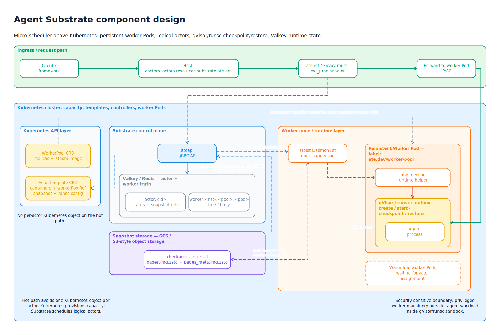</td>
  </tr>
</table>

✅ Preview emitted without diagnostics.

## coverage

12 objects · 8 lines · 1664×561

**Structural quality:** 0 layout contract violations · 0 object overlaps · 0 route–object intersections · 0 label–object overlaps · 0 label–label overlaps · 0 label–route overlaps · 0 unexpected shared runs · 1 crossings · 0 title crossings · 0 label–decor overlaps

**Perception:** 1.75 bends/line (max 6) · detour ×1.13 · backtrack 3% · 15/12 x/y guides for 7 boxes · peer-size CV 0.00 · gap CV 0.06 · label offset 0.0px

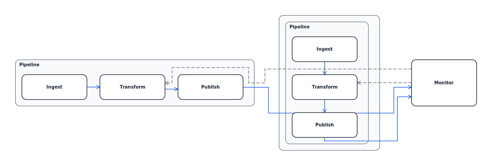

✅ Preview emitted without diagnostics.

## machine-thought-os

20 objects · 13 lines · 1235×1036

**Structural quality:** 0 layout contract violations · 0 object overlaps · 0 route–object intersections · 0 label–object overlaps · 0 label–label overlaps · 0 label–route overlaps · 0 unexpected shared runs · 2 crossings · 0 title crossings · 0 label–decor overlaps

**Perception:** 1.69 bends/line (max 4) · detour ×1.00 · backtrack 0% · 26/26 x/y guides for 12 boxes · peer-size CV 0.06 · gap CV 0.28 · label offset 0.0px

<table>
  <tr><th>Original</th><th>Prototype SVG</th></tr>
  <tr>
    <td></td>
    <td>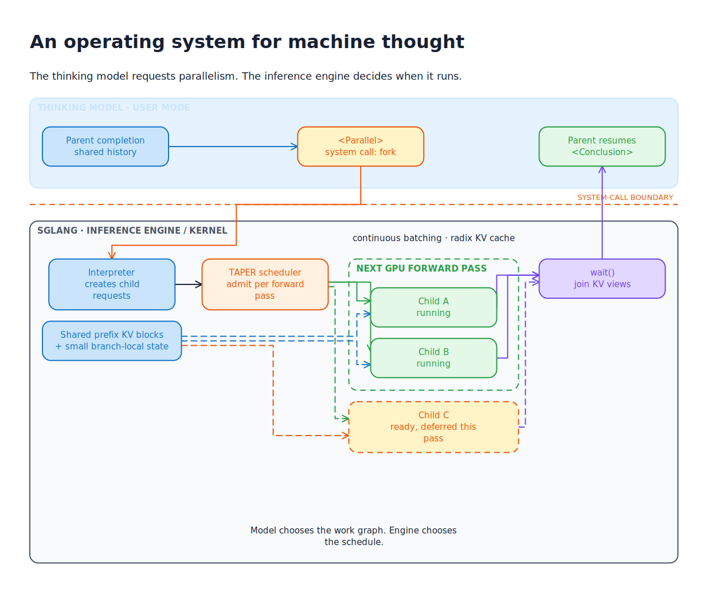</td>
  </tr>
</table>

✅ Preview emitted without diagnostics.

## modelplane-fleet-inference

39 objects · 19 lines · 1687×1470

**Structural quality:** 0 layout contract violations · 0 object overlaps · 0 route–object intersections · 0 label–object overlaps · 0 label–label overlaps · 0 label–route overlaps · 0 unexpected shared runs · 1 crossings · 0 title crossings · 0 label–decor overlaps

**Perception:** 1.58 bends/line (max 8) · detour ×1.07 · backtrack 3% · 47/32 x/y guides for 22 boxes · peer-size CV 0.08 · gap CV 0.30 · label offset 29.8px

<table>
  <tr><th>Original</th><th>Prototype SVG</th></tr>
  <tr>
    <td></td>
    <td>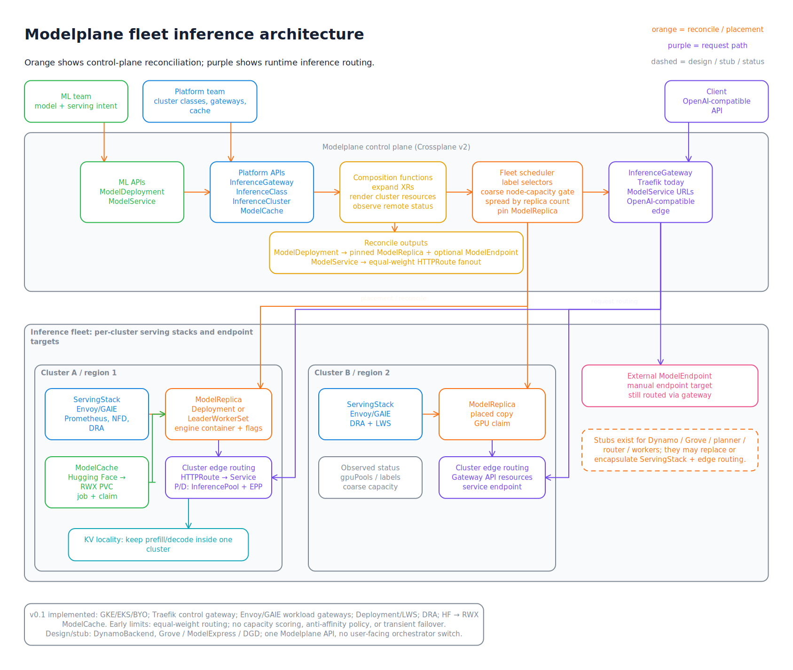</td>
  </tr>
</table>

✅ Preview emitted without diagnostics.

## uml-activity

19 objects · 15 lines · 999×799

**Structural quality:** 0 layout contract violations · 0 object overlaps · 0 route–object intersections · 0 label–object overlaps · 0 label–label overlaps · 0 label–route overlaps · 0 unexpected shared runs · 4 crossings · 0 title crossings · 0 label–decor overlaps

**Perception:** 1.20 bends/line (max 2) · detour ×1.00 · backtrack 0% · 16/35 x/y guides for 13 boxes · peer-size CV 0.17 · gap CV 0.34 · label offset 30.7px

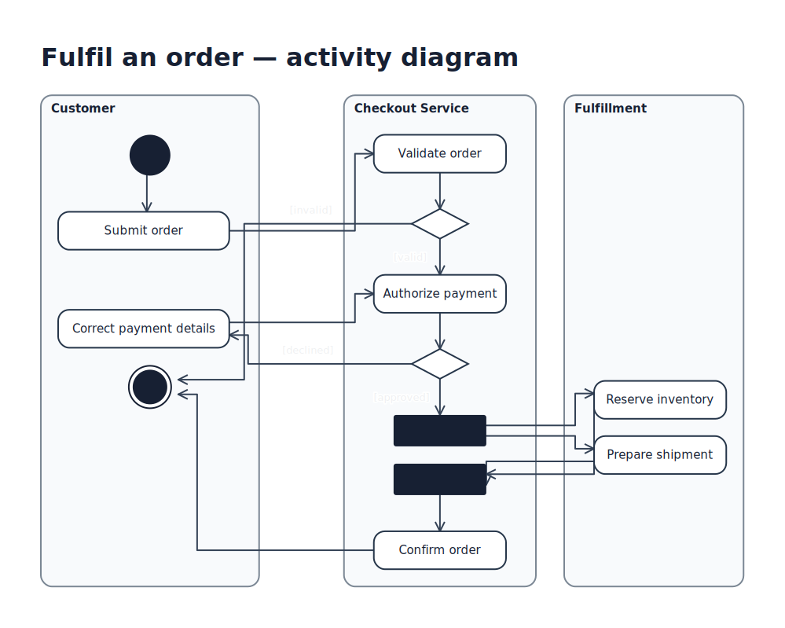

✅ Preview emitted without diagnostics.

## uml-class

13 objects · 8 lines · 1150×752

**Structural quality:** 0 layout contract violations · 0 object overlaps · 0 route–object intersections · 0 label–object overlaps · 0 label–label overlaps · 0 label–route overlaps · 0 unexpected shared runs · 1 crossings · 0 title crossings · 0 label–decor overlaps

**Perception:** 1.75 bends/line (max 4) · detour ×1.06 · backtrack 3% · 13/11 x/y guides for 9 boxes · peer-size CV 0.31 · gap CV 0.00 · label offset 20.2px

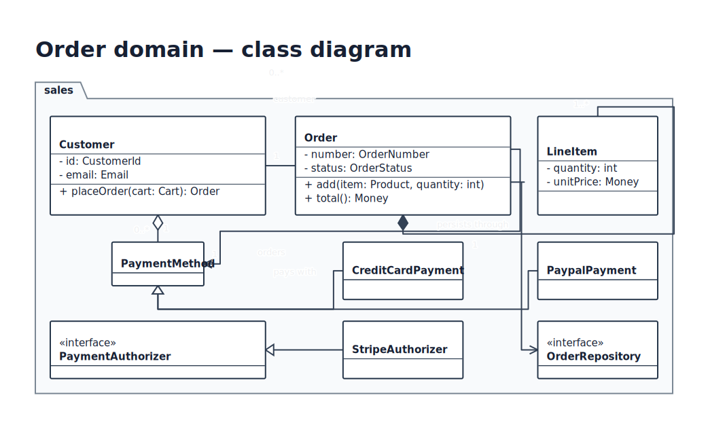

✅ Preview emitted without diagnostics.

## uml-component

9 objects · 4 lines · 952×429

**Structural quality:** 0 layout contract violations · 0 object overlaps · 0 route–object intersections · 0 label–object overlaps · 0 label–label overlaps · 0 label–route overlaps · 0 unexpected shared runs · 1 crossings · 0 title crossings · 0 label–decor overlaps

**Perception:** 1.75 bends/line (max 4) · detour ×1.13 · backtrack 6% · 14/6 x/y guides for 5 boxes · peer-size CV 0.07 · gap CV 0.09 · label offset 18.0px

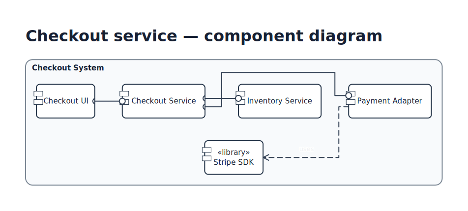

✅ Preview emitted without diagnostics.

## uml-deployment

13 objects · 4 lines · 945×724

**Structural quality:** 0 layout contract violations · 0 object overlaps · 0 route–object intersections · 0 label–object overlaps · 0 label–label overlaps · 0 label–route overlaps · 0 unexpected shared runs · 0 crossings · 0 title crossings · 0 label–decor overlaps

**Perception:** 3.50 bends/line (max 8) · detour ×1.30 · backtrack 12% · 9/12 x/y guides for 5 boxes · peer-size CV 0.09 · gap CV 0.00 · label offset 20.9px

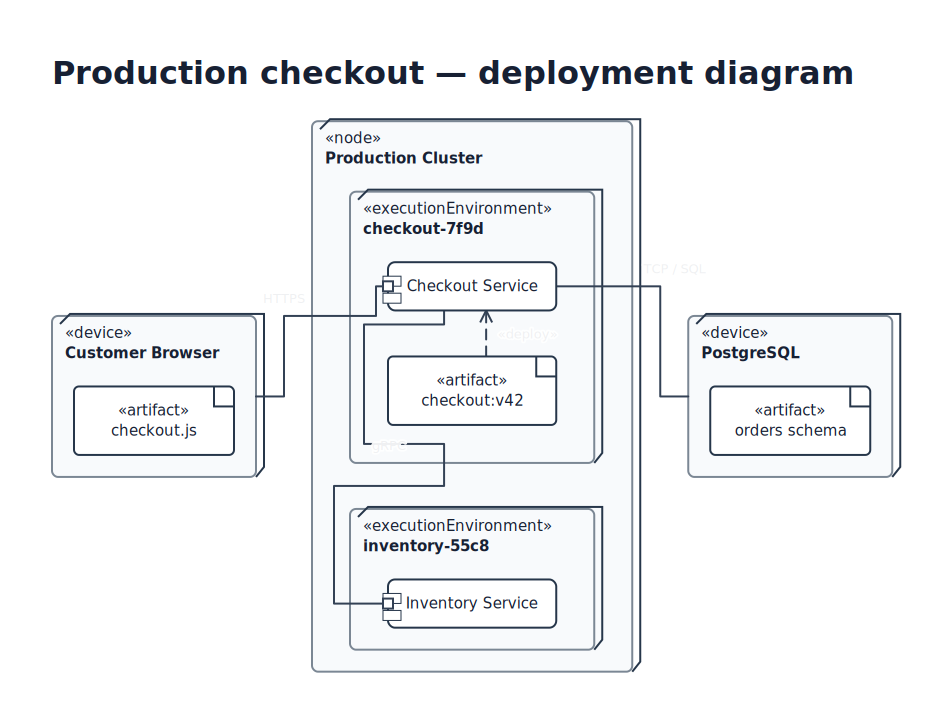

✅ Preview emitted without diagnostics.

## uml-object

7 objects · 3 lines · 1479×270

**Structural quality:** 0 layout contract violations · 0 object overlaps · 0 route–object intersections · 0 label–object overlaps · 0 label–label overlaps · 0 label–route overlaps · 0 unexpected shared runs · 0 crossings · 0 title crossings · 0 label–decor overlaps

**Perception:** 1.33 bends/line (max 4) · detour ×1.17 · backtrack 0% · 12/3 x/y guides for 4 boxes · peer-size CV 0.00 · gap CV 0.05 · label offset 18.0px

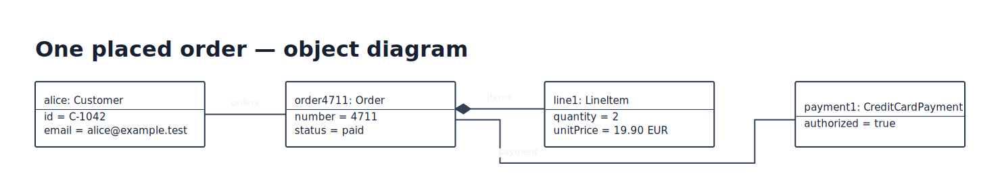

✅ Preview emitted without diagnostics.

## uml-package

13 objects · 4 lines · 707×702

**Structural quality:** 0 layout contract violations · 0 object overlaps · 0 route–object intersections · 0 label–object overlaps · 0 label–label overlaps · 0 label–route overlaps · 0 unexpected shared runs · 0 crossings · 0 title crossings · 0 label–decor overlaps

**Perception:** 0.50 bends/line (max 2) · detour ×1.00 · backtrack 0% · 10/9 x/y guides for 5 boxes · peer-size CV 0.00 · gap CV 0.00 · label offset 23.9px

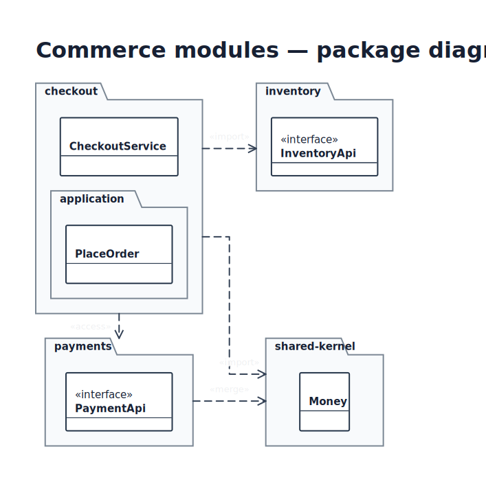

✅ Preview emitted without diagnostics.

## uml-sequence

36 objects · 12 lines · 1609×1000

**Structural quality:** 0 layout contract violations · 0 object overlaps · 0 route–object intersections · 0 label–object overlaps · 0 label–label overlaps · 0 label–route overlaps · 0 unexpected shared runs · 4 crossings · 0 title crossings · 0 label–decor overlaps

**Perception:** 0.00 bends/line (max 0) · detour ×1.00 · backtrack 0% · 20/12 x/y guides for 7 boxes · peer-size CV 0.66 · gap CV 0.69 · label offset 18.0px

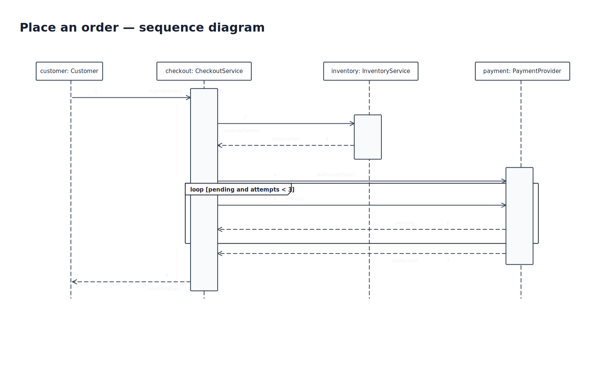

✅ Preview emitted without diagnostics.

## uml-state-machine

17 objects · 11 lines · 1144×1018

**Structural quality:** 0 layout contract violations · 0 object overlaps · 0 route–object intersections · 0 label–object overlaps · 0 label–label overlaps · 0 label–route overlaps · 0 unexpected shared runs · 0 crossings · 0 title crossings · 0 label–decor overlaps

**Perception:** 1.73 bends/line (max 4) · detour ×1.06 · backtrack 0% · 23/22 x/y guides for 10 boxes · peer-size CV 0.26 · gap CV 0.03 · label offset 44.1px

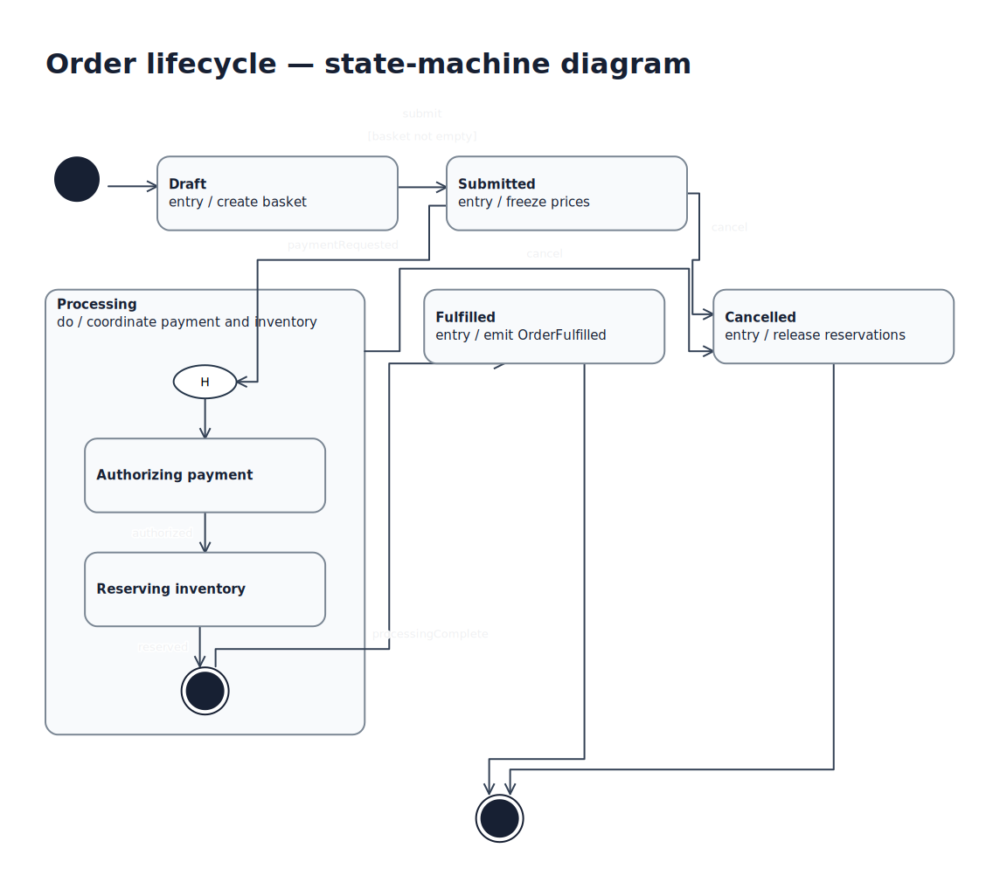

✅ Preview emitted without diagnostics.

## uml-use-case

17 objects · 9 lines · 1053×711

**Structural quality:** 0 layout contract violations · 0 object overlaps · 0 route–object intersections · 0 label–object overlaps · 0 label–label overlaps · 0 label–route overlaps · 0 unexpected shared runs · 0 crossings · 0 title crossings · 0 label–decor overlaps

**Perception:** 1.11 bends/line (max 2) · detour ×1.00 · backtrack 0% · 16/17 x/y guides for 10 boxes · peer-size CV 0.06 · gap CV 0.00 · label offset 27.4px

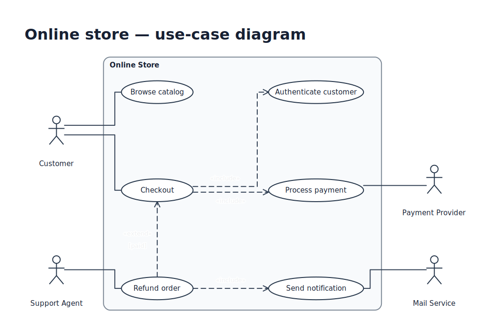

✅ Preview emitted without diagnostics.

## vegvisir-voice-agents

21 objects · 10 lines · 1400×879

**Structural quality:** 0 layout contract violations · 0 object overlaps · 0 route–object intersections · 0 label–object overlaps · 0 label–label overlaps · 0 label–route overlaps · 0 unexpected shared runs · 5 crossings · 0 title crossings · 0 label–decor overlaps

**Perception:** 1.30 bends/line (max 4) · detour ×1.11 · backtrack 5% · 20/31 x/y guides for 13 boxes · peer-size CV 0.20 · gap CV 0.05 · label offset 67.1px

<table>
  <tr><th>Original</th><th>Prototype SVG</th></tr>
  <tr>
    <td></td>
    <td>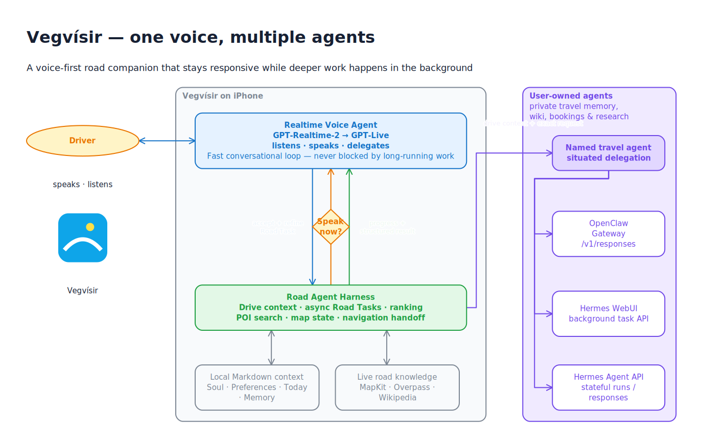</td>
  </tr>
</table>

✅ Preview emitted without diagnostics.
